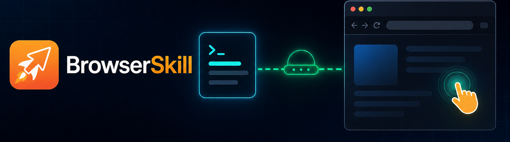
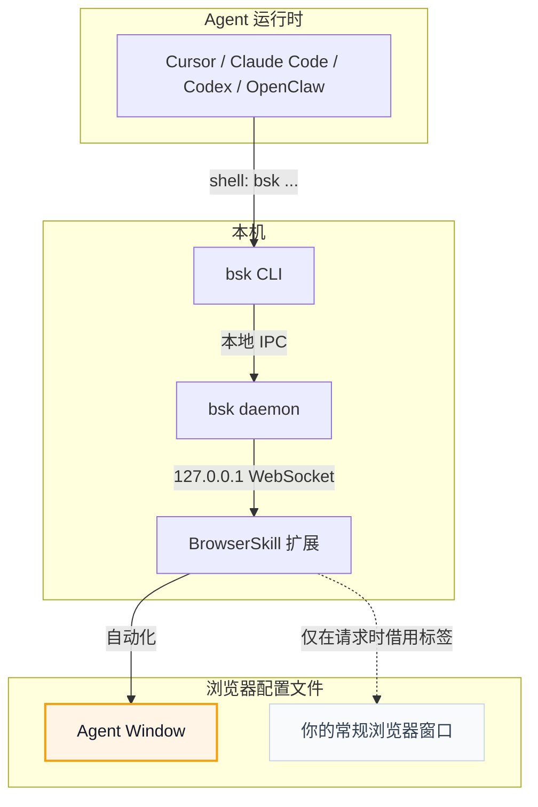

# BrowserSkill

<p align="center">
  
</p>

<p align="center">
  <strong>让 AI Agent 操作你的浏览器，而不打断你的工作。</strong>
</p>

<p align="center">
  <a href="README.md">English</a> · 中文
</p>

**BrowserSkill** 把 Cursor、Claude Code、Codex、OpenClaw、CodeBuddy、WorkBuddy、Pi、Hermes Agent 等支持 Shell 的 AI Agent 连接到你已登录的浏览器。

需要 Agent 操作你已打开的标签页？必须显式借用该标签，任务结束后归还，其余浏览器窗口不受影响。

https://github.com/user-attachments/assets/db782c92-b1d4-4aae-a255-039675937a90

## BrowserSkill 的优势

- **复用真实登录态**：Agent 可以操作你已经登录的网站，不需要额外测试账号。
- **不中断你的工作**：浏览器任务在独立可见的 Agent Window 中运行，不影响你继续使用自己的浏览器。
- **支持任意 Agent**：只要 Agent 能调用 Shell，就可以通过 `bsk` CLI 使用 BrowserSkill，不绑定特定模型、Agent 框架或 harness。
- **内置 human-in-loop**：遇到 captcha、登录、确认弹窗等必须由人处理的步骤时，Agent 可以主动请求你接管，完成后再继续任务。

## 运行环境

BrowserSkill 由两个本地运行组件组成：`bsk` CLI/daemon 和浏览器扩展。

| 运行项 | 支持情况 |
| --- | --- |
| 操作系统 | macOS（Apple Silicon 和 Intel）、Linux（x64 和 ARM64）、Windows x64 |
| 浏览器 | 已支持 Chrome 和 Microsoft Edge；其他支持加载 Chromium 扩展的浏览器通常可用；Firefox 计划中 |

## 快速开始

<details open>
<summary><b>让 Agent 帮你安装（推荐）</b></summary>

<br>

已经在用 Cursor、Claude Code、Codex 或其他支持 Shell 的 Agent？只需复制下面这句话发给 Agent，它会帮你安装 CLI 和 skill，并引导你加载浏览器扩展：

```text
按照 https://raw.githubusercontent.com/Tencent/BrowserSkill/main/AGENT_INSTALL.md 的说明，在本机安装并配置 browser-skill
```

</details>

<details>
<summary><b>手动安装</b></summary>

<br>

先安装 CLI，再从 [Chrome Web Store](https://chromewebstore.google.com/detail/hhcmgoofomhgciiibhipgmgkgnoenaoi) 安装浏览器扩展。

#### 1. 安装 `bsk` CLI

**macOS / Linux**（推荐，安装到 `~/.local/bin`）：

```bash
curl -fsSL https://raw.githubusercontent.com/Tencent/BrowserSkill/main/install.sh | sh
```

**Windows**：从 [最新 CLI release](https://github.com/Tencent/BrowserSkill/releases/latest)
下载 `bsk-v<version>-x86_64-pc-windows-msvc.zip`，解压后将 `bsk.exe` 加入 `PATH`。

验证二进制：

```bash
bsk --version
```

#### 2. 安装浏览器扩展

从 [Chrome Web Store](https://chromewebstore.google.com/detail/hhcmgoofomhgciiibhipgmgkgnoenaoi) 安装 BrowserSkill。

#### 3. 安装 skill

BrowserSkill 自带 skill，用于教 Agent harness 如何使用 `bsk`。以下 harness 可一键安装：

<p align="center">
<table>
  <tr>
    <td align="center" width="108"><a href="https://cursor.com" title="Cursor"></a><br /><sub><b>Cursor</b></sub></td>
    <td align="center" width="108"><a href="https://docs.anthropic.com/en/docs/claude-code" title="Claude Code"></a><br /><sub><b>Claude Code</b></sub></td>
    <td align="center" width="108"><a href="https://developers.openai.com/codex" title="Codex"></a><br /><sub><b>Codex</b></sub></td>
    <td align="center" width="108"><a href="https://openclaw.ai" title="OpenClaw"></a><br /><sub><b>OpenClaw</b></sub></td>
    <td align="center" width="108"><a href="https://www.codebuddy.ai" title="CodeBuddy"></a><br /><sub><b>CodeBuddy</b></sub></td>
    <td align="center" width="108"><a href="https://www.workbuddy.ai" title="WorkBuddy"></a><br /><sub><b>WorkBuddy</b></sub></td>
    <td align="center" width="108"><a href="https://github.com/badlogic/pi-mono" title="Pi"></a><br /><sub><b>Pi</b></sub></td>
    <td align="center" width="108"><a href="https://github.com/NousResearch/hermes-agent" title="Hermes Agent"></a><br /><sub><b>Hermes Agent</b></sub></td>
  </tr>
</table>
</p>

```bash
bsk install-skill
```

用 <kbd>Space</kbd> 选择需要安装的 Agent harness，然后按 <kbd>Enter</kbd> 安装 skill。运行 `bsk install-skill --list` 可查看 internal 变体及安装路径。

其他支持 Shell 的 Agent harness 也可使用 BrowserSkill，但需手动将 [`skill/SKILL.md`](skill/SKILL.md) 复制到对应 skills 目录下的 `browser-skill/SKILL.md`。

</details>

启动一个新的 Agent 会话，写一条需要使用浏览器的 prompt，例如：

```text
/browser-skill open example.com and summarize what is on the page.
```

## 工作原理

BrowserSkill 是 Agent 运行时与浏览器之间的本地桥接层。



Agent 不直接与浏览器通信。它通过 `bsk` CLI 下发浏览器任务；本地 daemon 把请求路由到扩展；扩展在 Agent Window 中执行。

## 面向开发者

本仓库是 Cargo + pnpm workspace：

- `crates/bsk-cli` — `bsk` CLI 与本地 daemon
- `crates/bsk-protocol` — 共享协议类型与 JSON Schema
- `apps/extension` — 浏览器扩展
- `packages/ui` 和 `packages/i18n` — 扩展 UI 共享支持

## 许可证

MIT
