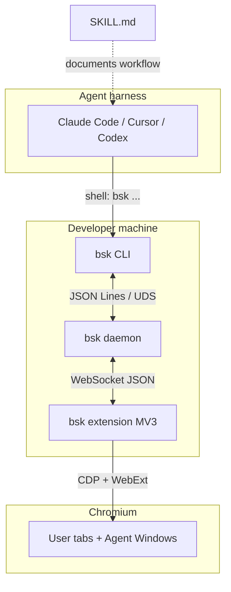
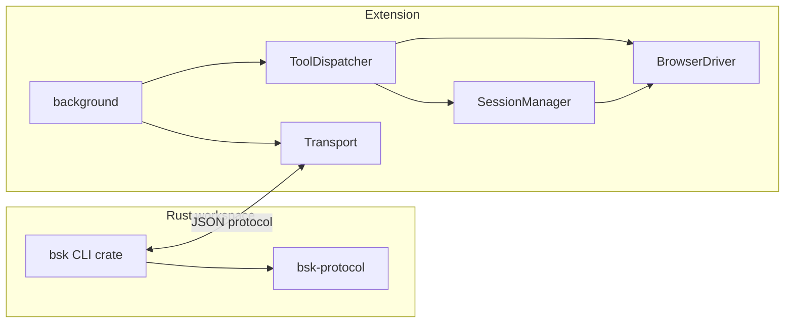

# browser-skill architecture

Developer-oriented overview of how the CLI, daemon, and extension fit together.
Consolidates design §2, §3, §5, and §6.

## System diagram



## Components

### bsk CLI (`crates/bsk-cli`)

- Parses verb-noun subcommands (`bsk session start`, `bsk click`, …).
- On first use, **auto-spawns** the daemon if `~/.bsk/daemon.lock` is absent or stale.
- Speaks JSON Lines over `~/.bsk/daemon.sock` (Unix) or a named pipe (Windows).
- Renders human-readable output by default; `--json` emits structured responses.

Key modules:

| Module | Role |
| --- | --- |
| `cli/` | Clap command tree, per-tool handlers |
| `ipc_client.rs` | UDS client, line framing |
| `daemon/` | WS server, session routing, idle shutdown |

### bsk daemon (same binary: `bsk daemon`)

- Listens on loopback WebSocket (default **52800**) for extensions.
- Validates `Origin: chrome-extension://…` on handshake.
- Maintains `browsers` (connected extensions) and `sessions` (Agent Window bindings).
- **Per-session queue** serializes tool calls targeting one session.
- Forwards `tool.*` RPCs to the correct extension connection.

State files under `~/.bsk/`:

| File | Purpose |
| --- | --- |
| `daemon.lock` | Advisory lock — single daemon instance |
| `daemon.json` | `{ sock_path, pid, ws_port, version }` |
| `daemon.log` | Rolling trace log |
| `daemon.pid` | PID for status/doctor |

### bsk extension (`apps/extension`)

WXT / MV3 Chromium extension. Built with React popup and a service worker background.

| Directory | Responsibility |
| --- | --- |
| `transport/` | Pluggable `Transport` (v1: `WSTransport`) |
| `tools/` | `ToolDispatcher` → 21 tool handlers |
| `session-manager/` | Sessions, Agent Window, ref-store (`@e1`) |
| `browser-driver/` | CDP-backed browser operations |
| `entrypoints/popup/` | Connection status UI |
| `content/` | Control overlay in Agent Windows |

### bsk-protocol (`crates/bsk-protocol`)

Shared Rust types + JSON Schema generation. TypeScript mirrors frame shapes in
`apps/extension/src/transport/types.ts` (kept in sync via tests and schema dumps).

## Typical tool call

1. Agent runs `bsk click @e1 --tab-id 42 --session ab12`.
2. CLI ensures daemon is running, opens UDS, sends one JSON request line.
3. Daemon resolves session `ab12` → browser client → forwards `tool.click` over WS.
4. Extension dispatcher validates sandbox rules, invokes CDP via `BrowserDriver`.
5. Response travels CLI ← daemon ← extension; CLI prints result and exits.

## Session and sandbox model

- **Session** = opaque ID (4 lowercase letters in v0.1) + dedicated **Agent Window**
  + session-scoped ref-store + borrow table.
- **Sandbox-only**: write tools require tabs inside the Agent Window unless the tab
  was **borrowed** from the user profile.
- **Session stop is mandatory** in agent workflows (`bsk session stop`); idle timeout
  (default 5 min) is a safety net only.
- Multiple sessions on one browser → multiple Agent Windows, fully isolated.

### tab_list scopes

| `scope` | Visible tabs |
| --- | --- |
| `user` | User profile windows (default) |
| `agent` | Current session's Agent Window only |
| `all` | Agent Window + user windows for this session |

## Concurrency

| Scope | Policy |
| --- | --- |
| Same session | Daemon serializes RPCs (ref-store safety) |
| Different sessions | Parallel |
| Multiple browsers | `bsk session start --browser <id>` when >1 extension connected |

## Module dependency graph



## Security (v1)

- Daemon and WebSocket bind to **loopback** only.
- Extension origin allow-list at WS upgrade.
- No credential storage in bsk — cookies stay in the user's browser profile.
- `evaluate` restricted to Agent Window tabs in sandbox mode.

## Repository layout

```
browser-skill/
├── apps/extension/       # WXT Chromium extension
├── crates/
│   ├── bsk-cli/           # `bsk` binary (CLI + daemon)
│   └── bsk-protocol/      # Wire types + schemas
├── install.sh            # CLI installer (GitHub Releases)
├── skill/SKILL.md        # Agent harness instructions
└── docs/                 # architecture, guides
```
