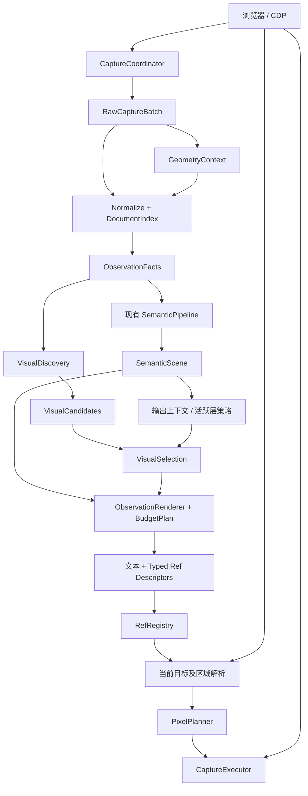

# BrowserSkill 视觉观察：架构设计、边界约束与 PR 实施计划

> 日期：2026-09-08  
> 状态：PR 0 设计验证稿；基线、浏览器实验和参数决策见 [验证结果](visual-observation-evidence.md)。生产实现尚未开始。执行步骤和成功条件见 [验收清单](visual-observation-acceptance.md)，无需另写报告。  
> 实施基线：从实施时确认的 main 新建分支；本次分析使用本地 main `3c5f838`。  
> 参考材料：当前 `fix/vom-canvas-observation` 分支、PR #165、此前的 visual-surface 架构蓝图。旧实现和旧测试是证据来源，不是不可改变的规格。  
> 本次范围：设计规格及可复现的合成 fixture/诊断工具；不修改生产代码，不继承旧分支提交。

## 1. 设计结论

本次工程的目标是：

**为 VOM 建立独立的视觉观察通道，共享可靠的采集与几何基础，通过明确的区域身份提供截图能力，并使处理成本随输入规模可预测增长。**

工作方式是先确定整体架构、行为契约、模块依赖、复杂度和验收矩阵，再分 PR 实现。分步实现不等于分步思考架构。任何实现阶段需要改变已定契约时，必须先更新设计及相关验收项，不得用局部特殊分支掩盖契约冲突。

本次不是一次目录整理，也不是通用视觉理解平台重写。设计完整覆盖当前能力的生命周期，但不为尚无需求和证据的未来能力预建实现。

### 1.1 必须成立的五个结果

1. observe 能表达“这里存在需要看图理解的 Canvas 内容”，不依赖该元素是否有可用 AX 语义。
2. 视觉入口的 document、frame、target、节点及坐标归属明确。
3. 视觉 ref 与 DOM 操作 ref 具有明确且不可矛盾的工具契约。
4. 截图解析当前目标并验证时效，返回浏览器最终合成的当前图像及真实尺寸。
5. 采集、索引、发现、选择、输出和截图均有复杂度或资源上限，并从首个实现 PR 开始验证。

### 1.2 不能用来证明成功的指标

- 代码文件拆得更多。
- 旧分支全部测试通过，但没有重新审核测试中的行为假设。
- 能识别某个特定 嵌入式 Canvas 表格 页面，却依赖站点 class、URL 或布局常量。
- 单个简单页面运行很快，但没有最坏输入分析。
- 文本出现 surface 标记，但其截图对应关系、时效和工具限制没有验证。

## 2. 问题本质与现状

### 2.1 main 的基础能力

当前 main 的主要路径为：

```text
DOMSnapshot + 各 frame 的 AX
  → FrameDocument
  → semantic graph：构建、解析、结构整理
  → VomScene
  → VOM 文本及 DOM ref
```

已经存在 frame document、语义图、几何模块、ref store、截图路径和显式栈渲染器。应复用这些职责，不在旁边建立第二套长期运行的采集、frame traversal 或语义树。

缺口是：元素的 DOM/AX 描述不等于 Canvas 内部的文字、图形和布局。补 role、名称或普通可点击 ref，并不能建立完整的视觉观察能力。

### 2.2 必须分别解决的问题

| 问题 | 要回答的具体问题 | 不属于该问题的内容 |
|---|---|---|
| 视觉发现 | 哪些 Canvas 构成可观察候选？ | 它是否可点击、输出多少条 |
| 空间定位 | 候选在顶层视口的区域是什么？ | 它是否重要、属于哪个业务画布 |
| 输出选择 | 有限预算下展示哪些入口？ | 改写几何事实、推断业务实体 |
| ref 身份 | 入口绑定什么目标、允许哪些工具使用？ | 像素缩放、内容识别 |
| 时效验证 | 当前目标是否仍符合此次观察契约？ | 保证 Canvas 像素未发生重绘 |
| 图像获取 | 如何获取当前合成区域并限制成本？ | 重建 Canvas 内部对象 |

### 2.3 当前分支值得保留与需要重审的部分

值得保留：语义/视觉双通道、视觉附录、单节点截图锚点、frame 几何共享、像素预算、相关失败场景和 fixture。

需要重审：

- 将 `aria-hidden`、`inert` 与视觉隐藏合并排除。语义暴露、交互资格、视觉存在是不同维度。
- 将旧区域与实时区域的交集当作时效验证。区域重合不能证明目标仍对应原观察。
- 将几何重合和共同父节点解释成逻辑画布身份。
- 将名称有无作为重要性的绝对优先条件，可能让大量有标签的小图排在无标签主画布之前。
- 视觉附录依赖 DOM 渲染后的剩余预算，可能使视觉通道完全消失。
- 在每个候选上重复祖先遍历，或假设引入空间索引便自动消除了最坏二次复杂度。

PR #165 优化了既有渲染及上下文查询路径。本次将它作为性能回归保护基线，不作为 Canvas 算法模板，也不据此要求重做原有算法。Canvas 的发现、裁剪、选择和截图具有不同的数据规模与访问模式，应分别设计和验证适合自己的算法。

PR 0 已在用户指定页面确认：表格实际绘制后，main 输出外围工具栏而没有表格列内容及视觉入口，且未截断。直接打开嵌入应用确认存在无标签 Canvas。内部页面资料仅留临时目录；入库使用匿名化结论和独立合成 fixture。

## 3. 范围收敛

### 3.1 本次纳入

- Canvas 元素锚定的视觉观察入口。
- 顶层、同 target 子 frame、OOPIF 及嵌套 frame 的身份和坐标归属。
- 已明确支持的视口及 overflow 裁剪。
- 无标签、存在 AX、不可交互但有视觉内容等候选情况。
- 有界输出选择及保守的重复截图入口去重。
- 视觉 ref 的工具契约和 document/几何时效检查。
- 截图区域解析、像素预算、真实输出尺寸验证和有界重试。
- 深层 DOM、密集小图、重叠 Canvas 和多 frame 的性能约束。

### 3.2 本次不纳入

- OCR、图像语义识别、Canvas 内部对象树。
- 画布内部点选、拖拽或内部对象 ref。
- 地图 tile 拼接、跨节点逻辑画布聚合、多 anchor 区域。
- 面向所有 SVG、视频、CSS 背景等介质的通用发现插件系统。
- 任意页面遮挡、透明度、clip-path 和 mask 的精确像素级重建。
- 改写所有现有语义算法、表单、hover probe 或 recording 协议。
- 新的 ref 字符串协议、跨 observe 持久对象 ID、分页接口。

边界外的能力可以提出独立设计，不能通过放宽当前去重阈值或给单节点 target 塞可选字段实现。

## 4. 总体架构



### 4.1 架构原则

1. 共享事实，分开解释。视觉存在不复用语义节点的保留/排除结论。
2. 语义关系是视觉区域的可选上下文，不是视觉身份的根。
3. 几何只有一套解释和投影实现，观察与工具执行使用不同生命周期的上下文。
4. renderer 只处理数据；浏览器调用止于采集或工具执行边界。
5. 预算选择只影响输出，不回写采集事实。
6. ref 的 kind 决定工具适用性，不能由调用者传入另一份可矛盾能力数组。
7. 模块失败必须可归因；不能将“没有候选”与“采集失败”混为一谈。
8. 所有资源限制都具有可解释的退化行为，不只是一句“超过上限停止”。

## 5. 模块划分与实现位置

以下为目标职责和建议位置，不要求第一个 PR 搬动全部文件。迁移文件与修改算法尽量分开；模块完成切换后删除被替代路径。

```text
apps/extension/src/tools/
  observation.ts                    # 工具入口与结果接线，逐步减去内部实现
  observation/
    capture-coordinator.ts          # CDP 编排及批次生命周期
    capture-types.ts                # 原始批次、归属、阶段状态
    normalize.ts                    # 原始节点 → 归一化事实
    document-index.ts               # 按 document 建立共享索引
    facts.ts                        # 下游可读事实契约
  geometry/
    coordinate-types.ts
    frame-context.ts                # frame/target 投影权威入口
    primitives.ts                   # 复用/迁入现有数学实现
  vom/
    capture.ts                      # 保留或拆出的 DOMSnapshot adapter
    frame-document.ts               # 复用现有 frame 归属逻辑
    semantic-graph/                 # 保留语义职责
    visual/
      types.ts
      discovery.ts
      selection.ts
      coverage-dedup.ts
  refs/
    target.ts
    resolve.ts
  screenshot/
    resolve-region.ts
    pixel-plan.ts
    capture.ts

apps/extension/src/session-manager/
  ref-store.ts                      # session 生命周期与注册存储

packages/vom/src/
  types.ts                          # 纯场景及渲染契约
  render.ts                         # 保留显式栈语义遍历
  render-budget.ts                  # 唯一输出预算核算
  visual-appendix.ts                # 纯数据视觉条目输出
```

不同时保留旧 `geometry.ts` 与新 primitives 的两套数学实现。上述目录可按现有工程规范调整，但职责与依赖不得随意调整。

### 5.1 CaptureCoordinator

输入：tab/target、已验证的 URL、取消信号、采集选项。  
输出：带来源、时间范围、document 身份和阶段状态的 RawCaptureBatch。

- 按 target 分组采集；DOMSnapshot 每 target 一次成功采集，重试单独计数且有界。
- AX 按协议支持的 frame/target 组织，数量有预算。
- 原始采集完成后才能运行会改变页面状态的 hover probe，保留已有行为顺序。
- 明确记录无法采集的 frame，不能把失败 frame 的数据借用其他 target 补齐。
- 不判断 Canvas 重要性，不投放 ref。

批次是来源和生命周期边界，不是浏览器原子事务。`Readonly` 或冻结对象不能证明各 CDP 响应来自同一瞬间。遇到可检测的导航/document 更换时应中止或有界重采集，不能拼接不同 document 的数据。

### 5.2 GeometryContext

输入：该次操作的 frame graph、原始 metrics、按需取得的 owner quad。  
输出：frame-local/target-local 到 top-viewport 的投影、裁剪及当前节点区域解析。

- 坐标类型同时携带空间及所属 frame/target；仅标记 `frame-local` 不足以防止错 frame 使用。
- 原始 DOMSnapshot 单位、CSS 视口单位、截图像素单位分别适配。
- Canvas 视觉入口采用元素 border-box 的可截图区域；实时解析明确请求同一种 box，不能沿用默认 content-quad 路径再将边框差异误判为移动。iframe 子视口投影仍采用 owner content quad，两者职责不同。
- 普通 overflow 裁剪使用 ancestor client/scrollport box，不使用祖先 border bounds。adapter 保留 includeDOMRects 的 client offsets/size 及其单位；存在缩放时先转换到相同坐标空间，禁止直接相加不同单位。证据不足时明确降级，不猜测 border/padding 常量。
- 一个操作内复用 metrics、owner quad 和 projection promise；不跨 observe 或 tool execution 复用 live geometry。
- 合成变换可以预计算；裁剪边界复杂度须真实计入，不能靠 promise cache 就宣称全部计算线性。
- 不允许通过 iframe border box 加减常量替代有证据支持的 content geometry。

### 5.3 Normalize / ObservationFacts / DocumentIndex

输入：原始批次及几何上下文。  
输出：按 document 隔离的只读事实和有界共享索引。

- Raw node 不能含语义不明的 top rect；normalized node 的派生字段由 normalization 创建。
- 节点 key 包含 document/target 所属信息，不能仅用 backendNodeId 跨 target 建表。
- 建立 node lookup、parent/children 等基础索引；派生索引必须有明确消费者和复杂度。
- 用显式栈和 visiting/visited 状态处理任意深度及异常环。
- orphan 保留“祖先信息不完整”状态；可以在已知范围内生成保守候选，但不能伪装成完整裁剪证据。
- 视觉样式、AX 暴露、交互资格分开保存，禁止万能 `excluded` 字段承载全部规则。
- 不给每个节点复制完整祖先数组或完整裁剪链；必要时共享结构或按需解析，计入内存预算。

### 5.4 SemanticPipeline

消费归一化事实，输出现有语义场景。通过窄 adapter 接入新事实契约；迁移完成后删除不再需要的 adapter。

- 不因为视觉发现需求改变 semantic keep/drop、名称恢复或可交互推断规则。
- 不把视觉候选塞回语义树遍历。
- PR #165 的显式栈、上下文索引及行为回归保留。
- 偶然发现的既有语义性能问题只作范围外记录，不构成本次工作项或前置依赖。本次只要求不使原有路径发生性能回退。

### 5.5 VisualDiscovery

输入：ObservationFacts。  
输出：候选及发现状态，不含最终 ref，不依赖 token 预算。

候选表达一个 Canvas 节点锚定的截图区域。必须具有可解析地址、支持范围内的几何证据和非空候选区域。

- 无 label 不排除；有 AX 内容也不能证明像素内容已被完整描述。
- `aria-hidden`、`inert`、`pointer-events:none` 不单独构成视觉排除原因。
- 零尺寸、无渲染区域、已证实的完全透明/隐藏、支持范围内的完全裁剪可排除。
- `visibility` 等继承与覆盖行为必须按实际 CSS 语义处理，不能把祖先 hidden 一律不可逆传播。
- `hidden` 等属性不应替代最终渲染事实；存在特殊状态时按实验确认的规则处理。
- agent 自身 overlay 排除应按所属 document/target 传播。
- 常规轴向 overflow 累积在一致的坐标空间计算；变换后不能把 top-space 包围矩形当作精确 local-axis clip。
- 不重建任意遮挡。几何区域是截图候选范围，不保证范围内每个像素均来自该 Canvas。

### 5.6 VisualSelection / CoverageDedup

输入：候选、输出上下文及预算规划所需参数。  
输出：选中候选、明确的遗漏/退化状态。

- 默认以区域覆盖量等可解释几何依据排序；label 是命名事实，不作为压倒面积的优先条件。
- 活跃层优先级属于选择策略；被降低优先级不等于物理不可见。
- 排序键预计算；同层按可见面积降序，再按 frameId、top y、left x、backendNodeId 升序决定顺序。字符串按代码单元字典序、数值按数值比较；同一精确去重组取该顺序最小者。不把跨批次 backend id 稳定性作为保证。
- 去重只减少重复截图入口，不产生新的 logical surface。
- 首版仅在同 document、同直接 DOM parent、四条裁剪边数值完全相同的候选之间去重，使用精确 key 的 Map；不使用近似 IoU、尺寸 band 或空间邻居比较。亚像素不同的范围保留独立入口。
- 首版不输出无法证明的 `layers=N` 业务解释。去重成员只是覆盖证据，不是内部对象模型。
- 精确去重索引达到 50,000 个 key 后，剩余候选以未去重形式继续进入有界选择，记录去重退化；不得直接丢掉剩余区域。索引已知 key 仍可命中去重。
- 即使没有去重，top-K 选择和总输出成本也必须有界。

### 5.7 ObservationRenderer / BudgetPlan

输入：SemanticScene、视觉选择结果和输出预算。  
输出：文本及与已提交行严格对应的 typed ref descriptors。

- 唯一模块核算总文本预算；摘要、头部、条目和截断提示全部计入。新 observe 的统一账本为每个实际输出行分别 `ceil(line.length / 4)` 后求和，length 使用 JavaScript UTF-16 单位；不混用整段核算与逐行核算。
- 保留语义显式栈和 DOM ref 相对顺序；视觉条目在语义阶段之后提交。
- 有视觉候选时，规划阶段预留简短视觉提示；其余视觉条目使用明确分配的剩余预算。
- 极小预算不保证语义与视觉同时完整，必须产生确定的截断结果。
- 写入行与提交 ref 在逻辑上原子：未写入的条目不能留下可解析 ref。
- 使用既有 token 估算方法时，预算表示“估算 token 上限”，不能宣称精确模型 tokenizer 上限。
- 新 observe 预算规划若发现显式预算不足以容纳最小协议头，返回 insufficient-budget，由工具层映射为既有 invalid_params，附最低估算成本；不生成半截协议头或新 ref。snapshot 的旧预算语义不在本次顺带改变。这是 observe 极小预算的明确兼容性例外。逐行统一账本也可能改变临界预算的截断位置；足够预算下无 Canvas 的语义文本及顺序保持不变。
- 首版固定视觉提示为 `[visual] Canvas regions present; use screenshot`，成本由同一估算器计算。有候选但条目不足时仍尝试保留提示；连提示也容不下则只返回合法的截断语义输出，truncated=true。未知计数不伪装成精确遗漏数。
- 输出标签最多 160 个 Unicode code point，再经 JSON escaping 与整行成本核算；排序不依赖标签长度。原始采集输入量 B 仍单独计入，不因输出裁剪便宣称采集内存有界。
- `snapshot` 继续使用既定静态语义输出；新视觉入口首先仅接入 `observe`。不要顺带改变 recording/其他调用方默认选项。

### 5.8 RefRegistry / Resolve

保存 session/tab 隔离的目标描述。DOM 与视觉目标通过判别联合区分；kind 为权威，外部展示能力可从 kind 派生。

```ts
// 概念契约，具体类型名与仓库适配时确定。
type RefTarget =
  | { kind: "dom"; address: NodeAddress }
  | {
      kind: "visual-region";
      anchor: NodeAddress;
      observed: ObservedGeometry;
      observationId: ObservationId;
    };

// NodeAddress 必须能表示 tab、CDP target、frame、document 身份及 backend node。
// 坐标值同时保留所属空间及 owner，不使用无归属 Rect 穿越模块边界。
```

工具适用性：

| 消费入口 | DOM ref | Visual ref |
|---|---|---|
| screenshot | 维持既有 DOM 截图策略 | 使用视觉区域策略 |
| click/fill/hover/select 等 | 维持既有检查 | 拒绝，且拒绝发生在派发输入前 |
| get_html | 维持既有行为 | 拒绝；不隐式降级为 anchor 的 HTML |
| 人工帮助定位 | 维持既有行为 | 若当前入口必须解释为 DOM 目标则拒绝；未来支持视觉区域需另立契约 |

所有 ref 消费者都必须通过类型化 resolver，不能依赖调用者记得传可选 capability 参数。

现有 `eN` 重用存在明确限制：如果新的 observe 已将 `e1` 重新绑定，单凭客户端传来的旧字符串 `e1` 无法判断它来自上一代。内部 generation 不会自动解决该问题。观察身份采用 target attach epoch + frameId + loaderId + documentElement backend identity，并在执行时验证 anchor 仍连接到匹配的 documentElement；loaderId 单独不足以覆盖 document.open。

本次保留当前“最新观察映射”的外部语义；只承诺能检测当前已存条目的 document/节点/几何失效，不承诺识别所有跨代旧字符串。彻底解决需独立协议设计。

### 5.9 ScreenshotExecution

分成三部分：

1. `resolve-region`：按目标种类解析当前身份与几何、验证 document 和区域变化。
2. `pixel-plan`：纯数值函数，输出 clip scale 等计划。
3. `capture`：overlay suppression、CDP 截图、真实尺寸读取、有界重试、取消及 dialog 集成。

- Visual ref 不自动滚动，不通过旧、新区域交集掩盖位移。
- 首版对超过既定容差的位移、尺寸或裁剪变化返回“需要重新观察”；容差在 PR 0 由测量误差证据锁定。
- 截图返回执行时浏览器最终合成图，不是观察时像素快照。
- document 身份验证不能替代几何验证；几何相同也不能证明 Canvas 内容未重绘。
- 像素规划采用明确 metrics 适配值；真实 PNG 尺寸是输出预算后置条件的依据。
- 尺寸头校验不宣称完整 PNG 内容验证；缺失/不合法数据与预算超限分开归因。
- 成功返回必须满足像素上限；有界重试仍失败则返回失败，不能猜测尺寸或无界重拍。

## 6. 算法与资源预算

### 6.0 两类独立的性能责任

**既有路径：防止回退。** 在相同输入、选项和环境下对照 main，检查原有语义处理、DOM ref、普通交互与截图的工作量、内存和实际耗时。不得因接入 Canvas 而重复运行语义解析、重建已有索引、增加原有节点的上下文查询，或撤销 #165 的优化。本次不要求把既有算法统一改成某个复杂度。

**新增路径：独立设计。** 围绕 Canvas 数量、frame 数量、裁剪复杂度、输出预算及截图像素量分析新成本；不照搬旧 renderer 的算法，也不以“旧算法使用了索引/显式栈”代替新问题的算法论证。下文复杂度与资源要求约束新增或本次实际改动的职责。

性能验收分三组，分别报告，不能互相替代：

| 验收组 | 对照方式 | 必须说明的结果 |
|---|---|---|
| 既有语义/操作路径 | 同一输入在 main 与新分支运行，隔离新增视觉工作 | 既有阶段未引入额外遍历、重复请求或可归因的性能回退 |
| 无 Canvas 页面 | 实际完整 observe 对照 | 仅保留必要的候选检测开销；确认无候选后不建视觉索引、不执行视觉几何查询或截图 |
| 有 Canvas 页面 | 单独测量视觉各阶段，再测完整 observe | 新成本与 C/F/P/K/像素等规模相符，资源有界；不把合理的新功能成本误记为旧算法退化 |

实际耗时需要多次同环境对照并结合操作数判断，不能仅凭一个容易波动的耗时值下结论。新增字段采集或共享模块调整的额外开销也必须归因并报告，不能藏在“原有成本”中。

### 6.1 规模定义

| 符号 | 含义 |
|---|---|
| B | 原始协议数据及字符串总量 |
| N | 采集 DOM 节点数 |
| A | AX 节点数 |
| F / T | frame 数 / CDP target 数 |
| C | 视觉候选数 |
| K | 最大选中输出条目数 |
| Q | 去重实际候选比较次数 |
| P | 几何计算量，如顶点处理、裁剪操作总数 |
| H | 语义上下文查询实际处理的数据总量 |
| L | 最终输出文本长度 |

不能忽略 B、P、H 后笼统宣称整个管线 `O(N)`。原始数据解码至少与输入量相关，复杂裁剪和语义上下文的总成本需要显式计算。

### 6.2 模块性能契约

| 阶段 | 复杂度/上限目标 | 禁止的实现 |
|---|---|---|
| 原始解码 | 与 B 线性相关 | 为每个节点重新解码共享列或字符串 |
| 文档索引 | `O(N + A + F)`，不含协议字节解码 | 每个候选全文扫描 |
| 可合成祖先状态 | `O(N)` 建立，候选常数次查询 | 每 Canvas 完整祖先 walk |
| Frame 几何 | 变换/证据按 frame 复用，额外成本计入 P | 每 node 查询 metrics/quad |
| 发现 | 索引后 `O(C)`，额外几何成本计入 P | 发现函数内重新查 CDP |
| top-K | `O(C log(K+1) + K log(K+1))` | 无需要地重复全量排序 |
| 去重 | 精确 key Map，摊销 O(C)，索引至多 50,000 个 key；首版 Q=0 | 引入模糊匹配和同 bucket 两两比较 |
| 新增视觉渲染与既有渲染接线 | 新增工作按选中条目及 L 核算；既有 H 对照 main 不回退 | 为视觉条目重新执行语义遍历或扫描全部节点 |
| 截图 | 调用和重试次数有界，成功图像像素数有界 | 无限重试、猜测输出尺寸 |

K 从预算允许的最小条目成本推导，并受异常安全上限约束；实际每行仍核算成本。面积优先 top-K 不应被描述为严格求解“可变长度条目预算最优装包”，本次不实现此类优化问题。

### 6.3 首版资源参数及锁定规则

以下是 PR 0 锁定的首版策略参数。它们是有明确退化语义的工程预算，不是性能最优值的统计结论；调整须更新对应契约测试：

- Visual 截图最大边：2048 px；最大面积：4,000,000 pixels。
- 单次视觉截图最多 2 次 capture 尝试。
- Frame 几何外部请求最大并发：4。
- K 异常安全上限 512；正常数量由预算与条目成本决定。
- 几何变化阈值：top-viewport CSS px 的四条边最大差值超过 0.25 即要求重新 observe；document、anchor、裁剪策略改变不受该容差豁免。
- 没有显式 maxTokens 时，视觉通道估算 token 预算 2048；有显式预算时，优先为固定摘要行按当前估算器计算实际预留量，条目用剩余预算，全部计入同一总预算。
- 精确覆盖去重索引最多 50,000 个 key；耗尽后继续未去重 top-K，标记 dedup-degraded；不得停止扫描剩余候选。
- 新增纯计算阶段每 256 个节点/候选形成可取消工作块；需要实际让出事件循环，而不是只读一个尚无机会更新的 AbortSignal。

每个限额均须有单位、适用阶段、计数口径和耗尽行为。数字集中在所属模块策略配置中，不散落为多个含义相近的常量。若 PR 0 未锁定参数及退化契约，对应实现 PR 不得以随意常量合入。

### 6.4 性能测试方法

- 节点访问、祖先推导、候选比较、CDP 请求数、最大并发及中间集合大小均做可断言计数。
- 对新增树处理使用深树/宽树测试，证明无调用栈溢出或重复全量扫描；既有 renderer 的对应输入用于 main 前后回归对照，不要求本次消除其历史复杂度。
- 规模翻倍时检查操作数增长是否符合分析，避免只看一次墙钟时间。
- 精确去重索引至少测试：全部重合、亚像素差异、同 crop 不同 parent、全部互不相交、容量耗尽；未来若引入空间索引，必须另增退化测试。
- 大量有名小图与无名主画布并存，验证排序不会因标签策略丢失主要区域。
- 保留 #165 回归；为新增模块增加性能契约，而不是声称旧测试覆盖整个链路。
- 真实耗时基准用于观察额外成本和实际收益，需记录环境；不使用耗时阈值代替算法验证。按验收清单的性能步骤 预热 3 次、交替采样 20 次，分别报告旧阶段和新增成本；旧阶段中位数增加超过 max(基线 10%, 2ms) 时独立复测，两轮均超过且可归因于改动则 FAIL，无法排除噪声则 BLOCKED。

## 7. 失败、降级与一致性

内部状态至少区分：

```text
capture-unavailable
document-changed
frame-ownership-unresolved
geometry-unavailable
geometry-unsupported
outside-supported-clip
discovery-partial
selection-truncated
dedup-degraded
target-detached
geometry-changed
image-invalid
pixel-budget-exceeded
```

这些是内部分类，不要求逐项扩展外部 RPC code。外部沿用既有错误分类并给出准确 message/必要 detail；不可把所有时效或几何失败叫权限问题。

原则：

- 视觉分支失败不应使已获得的语义结果无故丢失。
- 没有候选、没有预算、没有采集成功必须可区分。
- exact omitted count 只在可计算时输出；原始候选数与去重后的区域数不能相加冒充精确数量。
- 捕获批次不保证页面静止；可检测的身份变化必须处理，不可检测的像素重绘不作虚假保证。
- 取消在阶段边界和有界工作块之间检查，不能在大型纯计算循环结束后才响应。

## 8. 兼容性与影响面约束

1. 从 main 新建实现分支；不将当前分支整体 cherry-pick 作为迁移方式。
2. 没有视觉候选的页面，语义文本、DOM ref 相对顺序和操作行为维持原有契约。
   例外为上述 observe 显式预算小于最小协议头的 invalid_params 行为及统一账本导致的临界预算截断位置变化；足够预算不改变旧语义。
3. 有视觉候选的 observe 允许新增视觉文本，并按新预算规划改变截断位置；这是明确行为变化。
4. `snapshot`、recording、hover probe 默认行为不随视觉通道接入而隐式改变。
5. 修正已证明错误的坐标允许改变输出位置，不以错误 golden 为兼容目标。
6. 几何共享改动必须覆盖已有 DOM 点击/截图路径回归；不以 Canvas 测试代替。
7. CLI/协议外形优先保持；确需新增外部字段、错误子码或参数时，必须在对应 PR 明确列出全部消费者。
8. 不进行无关格式化、目录大搬迁、依赖升级或语义启发式修改。
9. 不长期保留两套 capture decoder、metrics adapter、frame resolver、token accounting 或 pixel planner。
10. 不把站点特征、fixture 标签、CSS class 或 URL 放入生产决策。

## 9. 设计验证清单与关闭方式

| 待验证项 | 证据 | 必须形成的决定 |
|---|---|---|
| 嵌入式 Canvas 表格 原始失败 | main 的观察输出、对应截图及结构证据 | 失败归属、最小复现和成功标准 |
| DOMSnapshot / metrics 单位 | DPR、zoom、scroll、frame 矩阵 | 原始单位适配和转换入口（实验结论见证据文档） |
| frame / target 坐标 | 同 target、OOPIF、nested、带边框/变换样例 | content quad 来源、坐标归属及支持范围 |
| document 身份 | 导航、同 frame document 替换、target 重建 | 使用哪些现有标识/事件，何时失效 |
| CSS 视觉规则 | visibility 覆盖、opacity、hidden、单轴 overflow | 可合成状态和不支持情况 |
| 时效容差 | 静止页面测量噪声、可控移动/缩放/裁剪变化 | 容差单位、比较规则和失败行为 |
| 预算 | 调用方 max_tokens 使用方式、密集画布样例 | 提示预留、K、限额与截断规则 |
| 去重 | 重合、近重合、不同父节点、相邻 tile | 首版等价规则和 Q 上限 |

验证结果与最终决定见 [PR 0 证据及决策](visual-observation-evidence.md)。首版精确几何支持收敛到已验证的轴向矩形、正向轴对齐平移/缩放、普通 frame/overflow 链。旋转、透视、clip-path、mask 和活动 pinch-zoom 不承诺精确区域 ref：返回 geometry-unsupported 状态并提示使用现有视口截图。后续扩展必须独立验证。浏览器 UI zoom 与 CSS zoom 分开验证，不能用 pinch emulation 代替 UI zoom。

进一步限定：CSS zoom/DOM transform 作用于 overflow 裁剪祖先的组合，首版也进入 geometry-unsupported。
实验表明 snapshot.bounds 已缩放，而 clientRects/offsetRects 仍有未缩放和整数取整语义，不能靠一个宽度比准确恢复所有边。
普通 Canvas 的 CSS zoom bounds 与 iframe content quad 缩放仍可使用；这不意味着缩放后的任意 DOM scrollport 都已获得精确支持。
Facts 必须保留 client box、transform/zoom 及 clip-path/mask 等支持性证据，discovery 返回状态而不是另写近似投影。

## 10. PR 划分与依赖

PR 0 是设计与证据入口；PR 1—6 建立模块；PR 7 接入公开 observe；PR 8 完成跨模块验收和迁移收尾。编号是顺序计划，不是实际 GitHub PR 编号。

```text
PR 0 设计规格与实验
  └─ PR 1 几何与身份契约
       └─ PR 2 采集批次与共享事实
            └─ PR 3 视觉发现
                 └─ PR 4 选择、去重与预算

PR 1 + PR 2 ──→ PR 5 类型化 ref
PR 1 + PR 5 ──→ PR 6 视觉截图执行

PR 2 + PR 3 + PR 4 + PR 5 + PR 6
  └─ PR 7 observe 组合与接线
       └─ PR 8 整体验收与迁移收尾
```

独立模块可以使用人工输入测试，不必等待真实上游接线。实现可依赖前序已合入 main 的 PR，避免多个大型长期分支互相漂移。阶段未接线的模块必须有紧邻的消费计划，不保留无期限死代码或对用户暴露半成品。

### PR 0：规格收敛、最小复现与基线

完成：

- 审核现有分支 fixture，区分正确规格与需要推翻的预期。
- 记录 嵌入式 Canvas 表格 原始失败及 main 基线，建立独立于站点的最小 fixture。
- 完成第 9 节实验，锁定核心数据类型、支持范围、容差和资源参数。
- 固定 #165 的相关回归结果和操作数基线；不夸大旧测试覆盖范围。
- 将行为契约映射到后续每个模块的测试清单。

不做：生产算法替换、全目录迁移、正式视觉通道接入。

验收：核心身份、坐标、裁剪、预算和失效规则不存在未指定行为；未支持情况有明确策略。若仍有未知项，先调整范围而不是让后续 PR 猜测。

### PR 1：统一几何与节点身份契约

完成：

- 引入有 owner 的坐标和地址类型，区分 frame/target/top/CSS/image 空间。
- 统一 metrics 解释、frame projection 和 owner geometry 查询。
- 共享单次操作内的 promise cache；保证采集和执行使用独立上下文。
- 给既有 DOM 几何入口做窄适配；移除已被替代的投影路径。

不做：Canvas 发现、排序、ref 外部行为变化。

验收：scroll、border、同 target、OOPIF、nested、支持范围内的 transform/DPR/zoom 矩阵通过；已有 DOM 点击与截图回归通过；请求计数和几何成本可解释。

### PR 2：采集批次、归一化事实和共享索引

完成：

- 将原始解码、采集编排、normalization 明确分开。
- 按 target 去重采集，记录 document 身份、时间范围和阶段失败。
- 建立 ObservationFacts、document 隔离 lookup/children 索引和正确的祖先状态结构。
- 现有 SemanticPipeline 通过 adapter 消费新事实；保持 hover 在静态采集后发生。
- 删除不再使用的可变中间态和重复解码/归属推断路径。

不做：变更语义保留规则、视觉输出和截图政策。

验收：语义回归及 frame ownership 通过；deep/wide/orphan/cycle 有明确结果；解码、索引、采集数量符合预算；无每节点完整祖先复制。

### PR 3：纯数据视觉候选发现

完成：

- 实现 VisualCandidate 及 discoverVisualCandidates。
- 落实无标签、有 AX、aria-hidden/inert/pointer-events、透明/隐藏、裁剪规则。
- 候选关联 document/anchor/geometry，语义上下文只作为可选信息。
- 返回发现失败或不完整状态，避免与无候选混淆。

不做：ref 分配、截图、token 排序、逻辑画布合并。

验收：每条发现规则都有正反 fixture；输入同一份事实输出确定；索引后的候选发现不重复扫 DOM 或走完整祖先链；不增加 CDP 调用。

### PR 4：有界选择、保守去重与输出预算计划

完成：

- 明确几何优先排序及确定性 tie-breaker，预计算比较键。
- 实现有界 top-K，K 受文本预算和安全限额约束。
- 实现精确覆盖 key 去重及索引容量耗尽后“继续未去重选择”的退化行为；首版 Q=0，不进行模糊两两比较。
- 建立纯 BudgetPlan 和视觉摘要/条目格式，统一预算核算契约。
- 明确候选数、输出数、遗漏数及去重退化信息的口径。

不做：多 anchor target、业务画布推断、生产 observe 接线。

验收：密集小图、无名主画布、全部重合、同 bucket 不等价、极小预算均有确定结果；比较次数、堆大小、输出成本有界。

### PR 5：类型化 ref 注册与工具解析

完成：

- RefStore 保存判别联合，绑定 document 及 observation 信息。
- kind 派生工具适用性，删除可独立构造的矛盾 capability 状态。
- 审核并迁移截图、交互、get_html、人工帮助等全部 ref 消费者。
- 保持 eN 外部语义，文档明确跨代字符串识别限制。

不做：引入新版 ref 协议、自动把视觉 ref 当 DOM anchor 使用。

验收：跨 session/tab 隔离；document 失效；全部工具矩阵通过；拒绝在输入派发前发生；旧 DOM ref 行为保持。

### PR 6：视觉截图的区域解析、像素规划与执行

完成：

- 分离 resolve-region、pixel-plan、capture executor。
- 实现 visual 不滚动、身份验证、几何容差及重新观察错误。
- 实现真实输出尺寸后置条件、有界重试和准确失败归因。
- 复用 overlay suppression、取消和 dialog 机制。

不做：Canvas 内部截图、像素冻结、多节点 union、内部点交互。

验收：移动/缩放/裁剪变化、节点移除、document 替换、DPR/zoom、无效图像、超预算和取消路径通过；成功图像符合像素预算；现有 DOM 截图回归通过。

### PR 7：观察结果组合与 observe 接线

完成：

- 将 Facts 的语义/视觉两路结果交给统一输出规划和 renderer。
- 保留 #165 显式栈和 DOM ref 相对顺序，追加视觉条目。
- 仅对已写入条目提交 ref，失败/截断状态正确传递。
- 视觉提示参与预先预算，避免 DOM 耗尽预算后完全无提示。
- 仅在 observe 默认启用新视觉通道；必要的 CLI/skill 使用说明同步更新。

不做：顺带修改 snapshot、recording 或 hover 默认策略。

验收：从人工 facts 到文本/ref 的集成测试、真实单 Canvas observe → screenshot 闭环通过；无 Canvas 页面回归通过；极小预算无悬空 ref。

### PR 8：跨模块验收、性能证据与收尾

完成：

- 在真实浏览器运行完整 fixture 矩阵和 嵌入式 Canvas 表格 原始场景，保存可复现结果。
- 验证整个管线的请求数量、集合规模、比较次数、深树安全和真实耗时。
- 检查新模块是否存在重复解释、长期 adapter、无消费者代码或语义影响扩散。
- 收尾剩余迁移文档、调试信息说明、支持范围和已知限制。

不做：把此前未测试的性能正确性全部拖到本 PR，也不接纳新的功能范围。

验收：第 11 节全部通过；若发现某模块契约错误，修正在该模块并补对应验收，不在最终接线处加站点特判。

## 11. 总体验收矩阵

本节是范围索引，具体怎么做、什么算成功见 [验收清单](visual-observation-acceptance.md)。新会话按当前 PR 执行并直接说明结果即可，无需报告模板或逐项登记。修改契约时同步清单，避免两套标准。

| 维度 | 必测场景 | 主要责任 |
|---|---|---|
| 发现 | 无名、有 AX、aria-hidden、inert、pointer-events:none | PR 3 |
| 视觉状态 | 零尺寸、透明祖先、visibility 覆盖、支持范围内 hidden 状态 | PR 0/2/3 |
| 裁剪 | viewport、单轴/嵌套 overflow、支持范围内变换 | PR 1/2/3 |
| frame | 同 target、OOPIF、nested、border、缺失 owner | PR 1/2 |
| 身份 | target 冲突、节点移除、导航、document 替换 | PR 2/5/6 |
| 输出 | DOM 顺序、视觉提示、modal 策略、极小预算、遗漏口径 | PR 4/7 |
| ref | 工具矩阵、跨 tab/session、无悬空 ref | PR 5/7 |
| 截图 | 几何变化、DPR/zoom、实际像素、重试、overlay | PR 6 |
| 算法 | 深树、宽树、高密度、全部重合、索引退化 | 各模块 PR |
| 回归 | #165、普通 DOM 点击/截图、snapshot、recording、hover | PR 1/2/7/8 |
| 产品结果 | main 原始失败与新链路的 嵌入式 Canvas 表格 场景对照 | PR 0/8 |

## 12. 相比旧蓝图的明确调整

| 旧方向 | 本文调整 | 原因 |
|---|---|---|
| 全链路 transaction 先行 | 建立来源明确的 capture batch；不承诺原子快照 | 生命周期模型不能代替一致性证据 |
| candidate → stack → logical surface 必经分层 | candidate + 输出覆盖去重；logical surface 不进入本次 | 限制身份模型及截图复杂度 |
| 统一祖先 excluded | 视觉、语义、交互状态分开 | 避免加速错误规则 |
| 各阶段一律兼容 adapter | 仅消费者迁移需要时使用，并随切换删除 | 避免临时抽象堆积 |
| 性能作为后续优化阶段 | 每个模块设计/实现均有复杂度与计数验收 | 防止功能完成后再补算法 |
| renderer 最后尝试附录 | 先规划预算，再分阶段输出 | 避免视觉入口系统性消失 |
| observed rect 与 live rect 求交 | 身份和几何分别验证 | 避免成功返回错误截图片段 |
| generation 暗示 freshness 已解决 | 明确现有 eN 重用限制 | 防止无法实现的旧字符串识别承诺 |
| 当前测试全部视为兼容基准 | 先审核期望，再保留正确回归 | 测试不能替代行为规格 |

## 13. 完成定义与设计变更纪律

工程完成必须同时满足：

- 五条核心结果全部成立，真实 嵌入式 Canvas 表格 场景及独立 fixture 均有证据。
- 每个模块只有一个权威实现，依赖方向与本文一致。
- 坐标和节点地址跨边界时身份明确，失败可归因。
- 视觉发现不依赖语义树保留结果，不混淆视觉与交互属性。
- 性能上限及退化可测试；复杂度没有遗漏协议输入量和几何工作量。
- 现有语义、DOM 操作及 #165 成果受到明确回归保护。
- 当前支持范围、近似/拒绝行为和 ref freshness 限制已记录。
- 不存在为了通过原始站点而增加的生产特判。

每个实现 PR 的描述必须写明：解决哪个独立问题、改变哪个契约、哪些行为允许变化、验证哪些正确性与性能要求、删除哪条旧路径。若没有删除旧路径，应说明保留原因和明确的后续消费/移除 PR。

新的案例若属于已定规则范围，应修复负责该规则的模块；若要求改变目标身份、几何支持或对外协议，应先形成设计变更。不得在 observation 接线、renderer 或截图执行末端不断补跨层例外。

## 14. 参考与证据来源

- 本地 main：`3c5f838`；当前分析分支：`fix/vom-canvas-observation`。
- PR #165 本地合并提交：`5ed8287`；实现提交：`641d934`。涉及 renderer 上下文索引、显式栈等优化。
- 主要代码范围：`apps/extension/src/tools/observation.ts`、`tools/vom/capture.ts`、`tools/vom/frame-capture.ts`、`tools/vom/semantic-graph/`、`tools/frame-geometry.ts`、`session-manager/ref-store.ts`、`packages/vom/src/render.ts`。
- 当前分支参考：`tools/vom/rendered-surfaces/`、`tools/visual-screenshot-plan.ts` 及相关 fixture/test。
- 原 visual-surface 架构蓝图作为历史参考，不是本设计的执行规格。
- 浏览器语义参考：[aria-hidden](https://developer.mozilla.org/en-US/docs/Web/Accessibility/ARIA/Reference/Attributes/aria-hidden)、[inert](https://developer.mozilla.org/en-US/docs/Web/HTML/Reference/Global_attributes/inert)、[visibility](https://developer.mozilla.org/en-US/docs/Web/CSS/Reference/Properties/visibility)。本次 CDP 单位、frame 和身份实验结论见验证结果文档；支持范围之外的行为不作推断。

本文中的路径为代码职责定位，最终目录命名可适配工程规范；行为契约、问题边界、复杂度预算和验收要求不能因此省略。
