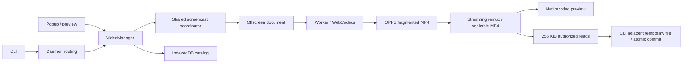

# Task video recording

Video recording captures one authorized task tab as a silent H.264 MP4. It is
independent of semantic action recording. This version keeps the tab fixed;
following task tab switches is deliberately deferred.

## User flow

Open the extension's Features → Video recording. Choose a running task and one
of its authorized tabs (a sole choice is selected automatically), set a duration
and quality, and start. The extension badge shows REC. Closing the popup is safe.
The recording panel shows elapsed/remaining time, Stop recording, and Stop task
actions. Stopping a video leaves its task running.

The recent recordings page offers native video playback, seeking, Save MP4 as,
and deletion. “Recording complete · waiting to save” remains until Chrome reports
a successful download. Canceled or failed downloads do not count as saved.
Partial recordings remain clearly labeled with their interruption reason.

The popup can copy an agent prompt. The CLI equivalent is:

```sh
bsk video start --session <task> --tab-id <tab> --duration 60s --quality standard
bsk video status --recording <recording_id>
bsk video stop --recording <recording_id>
bsk video save --recording <recording_id> --out ./result.mp4
bsk video list --browser <browser>
bsk video discard --recording <recording_id>
```

There is no default output directory. `stop --out` also exports; existing files
require `--overwrite`. CLI exports write on the CLI machine, while Save As writes
on the browser machine. Start supports a stable `--request-id` for lost-response
retries and `--max-duration` as an alias for `--duration`. Stop is idempotent after
automatic stop. Omitting an artifact selector requires exactly one match. `list`
discovers artifacts started from either UI.

Defaults: 60 seconds, standard quality (longest edge ≤1280, target 15 fps,
2 Mbps). Clear quality uses ≤1920, target 30 fps, 4 Mbps. Limits: 1 second to
10 minutes, 256 MiB per video, 1 GiB temporary budget, 24-hour retention. Frame
rate and bitrate are targets; static pages use sparse samples with real durations.
H.264 availability depends on the browser and OS; unsupported configurations fail
before a successful start response. Microphone/system audio is never requested.

## Architecture



`VideoManager` owns target authorization, one-browser concurrency, lifecycle,
overlay coordination and connection ownership. The offscreen host manages one
worker independently of popup lifetime. The worker owns the encoder and OPFS
files. Mediabunny muxes and remuxes packets; there is no runtime ffmpeg dependency
and no second encode when producing the final seekable MP4.

State transitions are `starting → recording → finalizing → ready|failed`.
Starting returns only after encoding the first valid frame. Capture stops on the
selected deadline or size cap, and on tab/session/connection termination.
Intentional user/cap stops are complete; interruptions are partial if playable.
The catalog preserves the reason and any failure, independently of live sessions.

The CDP screencast coordinator owns one stream and ACK per tab/attachment. Video
and Windows long-screenshot keepalive share leases. Releasing an old lease cannot
stop a replacement attachment or another consumer. Capture retains only an
in-flight frame and the newest pending frame. Canvas dimensions stay fixed and
resizes are letterboxed. A monotonic timeline preserves elapsed static time and
caps the final duration without compressing periods with dropped frames.

Video's idempotent overlay lease is separate from short screenshot suppression.
Content checks the lease before mounting. Interactive confirmation/help overlays
wait until frame intake closes and the worker switches to a neutral slate. Clean
rendering is acknowledged before capture resumes; stale document messages and
pre-resume frames are rejected. Popup task interruption remains accessible.

## Storage, access and failure handling

Fragments are flushed during recording. Normal stop remuxes complete packets into
a seekable MP4 without reencoding. Recovery discards incomplete tail boxes and
uses complete fragments. An interrupted final fragment can be lost; this is
reported as a partial recording, never as a complete result. No complete fragment
means failed with an actionable error. Worker failure resets the encoder worker
so a bounded recovery attempt can salvage committed fragments.

The catalog and OPFS artifacts survive task deletion and connection teardown.
Reserve space for both the recording and its final remux before starting. Count
failed journals and unfinished remux files against the budget. Expired artifacts
are removed on startup/catalog access; unexpired evidence is never silently
evicted to make room.

Artifact IDs are not authority. Remote reads also require the original connection
owner and a random capability. Only extension-owned popup/preview pages can use
the local UI bridge. Content messages are restricted to the sender's current
top-level document. Public metadata strips capabilities. The CLI stores private
grants in the existing per-user application directory, and the browser catalog
remains authoritative after reconnects.

`tool.video` exposes a versioned capability probe. Start uses the existing task
queue and user-interrupt gate; artifact/status/stop operations route directly to
the selected browser, so they remain usable during long actions and after task
deletion. Chunk identity, offset, decoded length and total size are validated.
The final user path never crosses the browser transport. A failed transfer cannot
replace an existing destination or expose a partially written final file.

## Validation

Unit coverage includes timeline bounds, fragment salvage, bounded frame intake,
ownership/capabilities, idempotent stops, overlay gating, and screencast sharing.
Existing full-page screenshot lifetime tests cover cancellation and attachment
replacement. The opt-in browser regressions use temporary Chrome profiles and an
isolated daemon, with the production extension/encoder and real MP4 decoding:
use Chrome for Testing to allow loading the isolated unpacked extension.

```sh
cargo build -p bsk --locked
pnpm --filter @browser-skill/extension build
cd apps/extension
BSK_VIDEO_CHROME=/path/to/chrome BSK_VIDEO_BSK=../../target/debug/bsk \
  pnpm exec vitest run src/video/*.browser.test.ts
```

The extension's minimum Chrome version remains 125. Codec support is validated at
runtime. The injected DSH tool set is unchanged; its skill describes the extension
workflow without inventing unsupported video tools.
